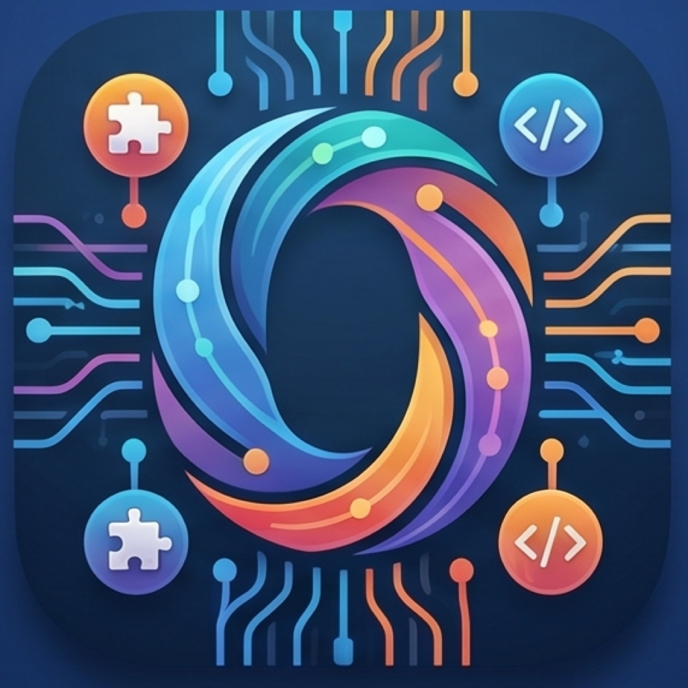

# OpenWork Native



A native macOS desktop client for [OpenCode](https://opencode.ai), inspired by
[OpenWork](https://different.ai) from Different.AI. Local-first: the app talks
directly to a locally-supervised OpenCode server against a folder you choose —
no cloud control plane, no hosted workers.

> **Status:** MVP / pre-alpha. Core OpenCode integration is implemented in
> code, but live API smoke testing and release hardening remain. See
> [SPEC.md](SPEC.md) and [TODO.md](TODO.md) for progress and open issues.

## What it does

- Resume the last workspace and session by default, so launch continues the
  most recent work.
- Make creating a new workspace or session a quick action instead of a required
  navigation step.
- Start, supervise, and stop a local OpenCode server bound to that workspace.
- Create, list, and open OpenCode sessions; send prompts and stream responses.
- Render markdown transcripts with copy support; retry is tracked as follow-up.
- Surface plan steps, tool calls, and file-change activity as the agent works.
- Prompt for permission when OpenCode requests a tool/path (allow once, deny,
  always allow).
- Read model/provider configuration, change the default model through OpenCode,
  choose a per-session model from the transcript header, and surface OpenCode auth errors.
- Reveal changed files in Finder or open them in your editor.

## Explicitly out of scope (MVP)

Cloud control plane, hosted workers, org/team provisioning, billing, remote
worker connection, UI-control MCP bridge, Slack/Telegram connectors, hosted
skill hubs, browser/mobile parity, multi-user workflow distribution. See
[SPEC.md](SPEC.md) for the full list.

## Current tracking

Task tracking uses `git issue` in this repo. Run `git issue ready` for the
current queue; `TODO.md` mirrors the high-level checklist.

## Requirements

- macOS 14 (Sonoma) or later
- Swift 6.0 / Xcode 16+
- An [OpenCode](https://opencode.ai) binary on `PATH` (the app shells out to it
  for the local server)
- A configured model provider (API key) for OpenCode

## Build & run

Use [Mask](https://github.com/jacobdeichert/mask) as a script runner:

```sh
mask build
swift run OpenWorkNative
```

Run lint and tests:

```sh
mask lint
mask test
```

Build a local `.app` bundle (versioned from git, signed with the local
self-signed identity if present):

```sh
mask app
```

### Install for daily use

Create a stable self-signed code-signing identity once. Signing with a fixed
identity (rather than a per-build ad-hoc signature) gives the app a stable
designated requirement, so macOS TCC permissions and Keychain ACLs survive
rebuilds instead of resetting each time:

```sh
mask cert
```

Then build and install the bundle into `~/Applications`:

```sh
mask install
```

`mask app` (used by `mask install`) signs with the `OpenWorkNative Local`
identity when it exists, and otherwise falls back to an ad-hoc signature with a
warning. The bundle is non-sandboxed and not notarized — intended for local use,
not distribution to other machines.

The version is derived from git: `CFBundleShortVersionString` comes from the
latest `vX.Y.Z` tag (`0.0.0` until you tag a release), `CFBundleVersion` from
the commit count, and the full `git describe` is recorded in a `GitDescribe`
Info.plist key.

The app icon is generated at build time from `Assets/AppIcon.png` (a 1024×1024
master) into `AppIcon.icns` via `sips`/`iconutil`. Replace that PNG and rebuild
to change the icon.

Open in Xcode:

```sh
open Package.swift
```

## Layout

```
Sources/OpenWorkNative/
├── OpenWorkNativeApp.swift     # SwiftUI app entry point
├── AppState.swift              # Top-level observable state
├── Models.swift                # Session, message, permission types
├── Services/
│   ├── OpenCodeProcessManager  # Spawns / supervises the local OpenCode server
│   ├── OpenCodeClient          # HTTP + SSE client against the server
│   └── WorkspaceStore          # Recent-workspace persistence
└── Views/
    ├── ContentView             # Root layout
    ├── ManagementView          # Workspace + session list sheet
    ├── TranscriptView          # Composer + streamed messages
    ├── ActivityView            # Plan / tool-call timeline
    └── SettingsView            # Model, provider, permissions
```

## Architecture

The native app is the only process boundary. It manages an OpenCode server as
a child process and talks to it directly over its local API:

```
Native app
  └─ UI, workspace picker, process manager, prefs, keychain
       │
       ▼
  local OpenCode server
       └─ sessions · SSE events · permissions · file/status · workspace files
```

An intermediate server may be introduced later if remote workers or stronger
abstraction become necessary; for the MVP it is deliberately absent.

## Credits

Inspired by [OpenWork](https://different.ai) (Different.AI). Built on top of
[OpenCode](https://opencode.ai).
